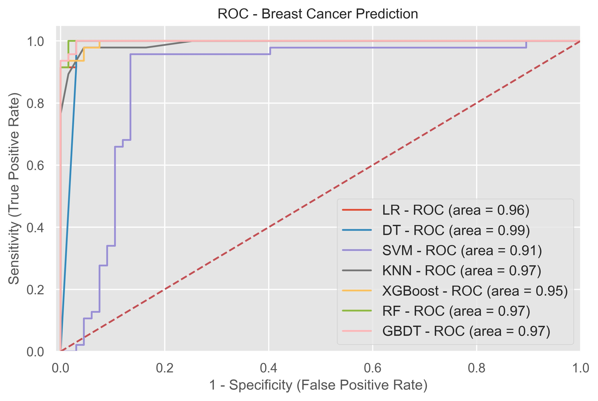
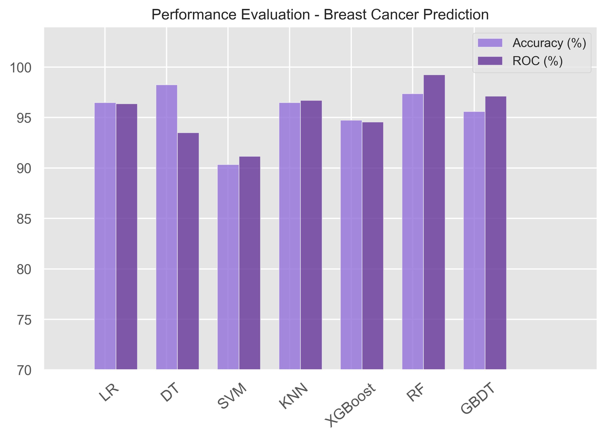

  <h1>🩺 Breast Cancer Prediction using Machine Learning</h1>

  
A machine learning project that builds, evaluates, and compares multiple classification models to detect <strong>malignant</strong> and <strong>benign</strong> breast tumors based on medical diagnostic features. This project utilizes feature selection, model comparison, ROC analysis, and visualization to identify the best-performing classifier.

  <h2>📂 Project Structure</h2>
  <pre><code>
📁 Breast-Cancer-Prediction/
├── Breast Cancer Prediction.ipynb       # Main notebook
├── breast_cancer_model.pkl              # Final saved model
├── PE_breast_cancer.jpeg                # Accuracy & AUC bar chart
├── roc_breast_cancer.jpeg               # ROC curve comparison
├── README.md                            # Project documentation
  </code></pre>

  <h2>🧠 Problem Statement</h2>
  
Breast cancer is one of the leading causes of cancer-related deaths in women. Early and accurate diagnosis significantly improves survival rates. This project leverages machine learning to automate breast cancer classification based on clinical features extracted from digitized images of fine needle aspirate (FNA) of breast masses.

  ### 📊 Dataset

- **Source:** [Kaggle - Breast Cancer Dataset by Nancy Alaswad](https://www.kaggle.com/datasets/nancyalaswad90/breast-cancer-dataset)
- **Size:** 569 samples × 30 numeric features
- **Target:**  
  - `M` = Malignant (mapped to 1)  
  - `B` = Benign (mapped to 0)
- **Description:** Each row corresponds to a breast tumor and includes 30 features computed from a digitized image of a fine needle aspirate (FNA) of a breast mass.

  <h2>⚙️ Machine Learning Models Used</h2>
  <table border="1" cellpadding="6">
    <thead>
      <tr><th>Model</th><th>Type</th></tr>
    </thead>
    <tbody>
      <tr><td>Logistic Regression</td><td>Linear Classifier</td></tr>
      <tr><td>Decision Tree</td><td>Tree-based Model</td></tr>
      <tr><td>SVM (Support Vector Machine)</td><td>Kernel-based</td></tr>
      <tr><td>K-Nearest Neighbors</td><td>Distance-based</td></tr>
      <tr><td>XGBoost</td><td>Ensemble Boosting</td></tr>
      <tr><td>Random Forest</td><td>Bagging Ensemble</td></tr>
      <tr><td>Gradient Boosting</td><td>Ensemble Boosting</td></tr>
    </tbody>
  </table>

  <h2>📈 Model Evaluation</h2>
  
Models were evaluated using the following metrics:

  <ul>
    <li>Accuracy (% correct predictions)</li>
    <li>ROC AUC Score (area under the ROC curve)</li>
    <li>ROC Curve (visualizing TPR vs FPR)</li>
    <li>Confusion Matrix (not shown here, but can be included)</li>
  </ul>

  <h3>🔍 Visualization Samples</h3>
  
<strong>1. ROC Curve Comparison</strong>

  

  
<strong>2. Accuracy vs AUC Scores</strong>

  

  <h2>🧪 Feature Selection</h2>
  
Highly correlated features (correlation > 0.92) were automatically removed using a lower-triangular correlation matrix mask. This reduces redundancy and prevents overfitting.

  <h2>🧰 Tools & Libraries</h2>
  <ul>
    <li>Python</li>
    <li>pandas, NumPy</li>
    <li>scikit-learn</li>
    <li>XGBoost</li>
    <li>Matplotlib, Seaborn</li>
    <li>Pickle (for model saving)</li>
  </ul>

  <h2>💾 How to Use</h2>
  <ol>
    <li>Clone this repo:
      <pre><code>git clone https://github.com/wasayfaizan/breast-cancer-prediction.git</code></pre>
    </li>
    <li>Install dependencies:
      <pre><code>pip install -r requirements.txt</code></pre>
    </li>
    <li>Run the notebook:
      <pre><code>jupyter notebook Breast\ Cancer\ Prediction.ipynb</code></pre>
    </li>
    <li>Load the final model:
      <pre><code>import pickle
model = pickle.load(open("breast_cancer_model.pkl", "rb"))</code></pre>
    </li>
  </ol>
</body>
</html>
